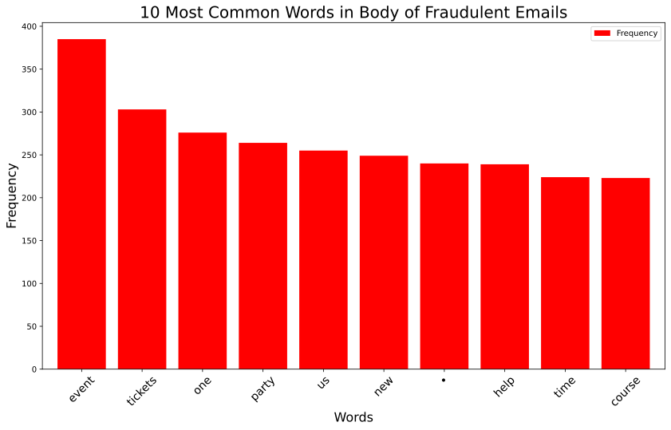

<div align="center">  
<header>
    <h1>Who You Gonna Call?<br>
    Fraud-Busters</h1>
  </header>
<div align='left'>  

<div align="center"> 

<div align='left'> 


## Table of Contents
1. [Background](#background)
2. [Data](#data)
3. [EDA](#eda)
4. [Models and Analysis](#models-and-analysis)
5. [Web App](#web-app)

## Background

Our team, the Fraud-Busters, was hired by an e-commerce site to weed out fraudsters. The fraudsters sent emails to users with fraudulent event tickets for purchase, and the e-commerce site would like to weed out these emails and events so no consumers click the links to purchase fradulent event tickets. The e-commerce site would like a web application that can be used to quickly triage potential fraudulent transactions as low risk, medium risk or high risk.   


## Data  

### Initial Data
We started with a json file of the current data from the e-commerce site. Any of the date columns had to be converted to datetime from a Unix timestamp in seconds. We cleaned up the description column to make it easier to use in our models.  

We engineered a target column ```Label``` that is set to 1 if the transaction is fraudulent and 0 if it is not fraud based on the data in the ```acct_type``` column. 


## EDA

### What is Fraud?  

Failures are not created equal:
-  False positives decrease customer trust
-  False negatives cost money, and not all of those cost the same amount of money

The model will not necessarily flag incoming transactions as fraud or not fraud, but instead allows the transactions to be flagged as needing further review due to the risk level. This is why the model is one that triages the most pressing (aka costly) transaction coming in.

### Can We See a Difference in Words Used?

  

  

### Cleaning Up the Feature Matrix
-  need to add info here

## Models and Analysis

### Choosing Our Model
Our team decided to build a variety of baseline models to compare before settling on the best model:
- Logistic Regression
- Random Forest

we decided to move forward with our **Random Forest** baseline model and continue to tune the hyperparameters and feature matrix based on:
> **Precision** - how many selected items are relevant  
> **Recall** - how many relevant items are correctly selected  
> **F1-score** - accuracy  

For our model, with Fraud = 1 (true positive) we want the highest recall score meaning we are correctly identifying all fraudulant transactions; however, if we are discussing cost relating to investigating transactions we also want a high precision score meaning we are reducing the number of false positives (falsely identified as a threat).

**Logistic Regression**  
<div align="center"> 

<div align='left'> 


**Random Forest**  
<div align="center"> 

<div align='left'> 


### Final Model
- final model in model.py file
- An overview of a chosen “optimal” modeling technique, with:
1. process flow
2. preprocessing
3. accuracy metrics selected
4. validation and testing methodology
5. parameter tuning involved in generating the model
6. further steps you might have taken if you were to continue the project.
- pickle the model

### Predicting with Our Model

- predict.py from test_script_examples file
- create database to store predictions

## Web App

### Fraud Scoring Service
 - link to web app and maybe screenshot

### Live Data
- use app with live [data](http://galvanize-case-study-on-fraud.herokuapp.com/data_point)
